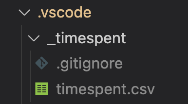

# Time Spent

Track time spent in vscode.

## Features

- Time entries are stored per workspace in a local .csv file.
- Time is tracked by file path, current git branch and commit hash.
- Daily summary report.
- CSV export of time entries.

## CSV File Storage

Time entries are stored in a `.csv` file at `.vscode/_timespent/timespent.csv` in the workspace.

## Commands

The following commands can be run from the command palette (`cmd+shift+p`, `ctrl+shift+p`)

- `Time Spent: Daily Workspace Summary` - Outputs a daily summary report in an output panel.
- `Time Spent: Export Time Entries to CSV` - Save all time entries to a .csv file.

## Configuration Settings

- `storageDir` - Optional storage directory path where the time tracking `.csv` file will be stored. Defaults to `.vscode/` folder in current workspace.
- `inactivityTimeoutMs` - Optional inactivity timeout in milliseconds. Defaults to `60000`.
