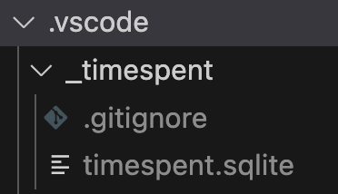

# Time Spent

Track time spent in vscode.

## Features

- Time entries are stored per workspace in a local sqlite database.
- Time is tracked by file path, current git branch and commit hash.
- Daily summary report.
- CSV export of time entries.

## Sqlite Database

Time entries are stored in a `sqlite` database at `.vscode/_timespent/timespent.sqlite` in the workspace.

## Commands

The following commands can be run from the command palette (`cmd+shift+p`, `ctrl+shift+p`)

- `Time Spent: Daily Workspace Summary` - Outputs a daily summary report in an output panel.
- `Time Spent: Export Time Entries to CSV` - Save all time entries to a .csv file.
